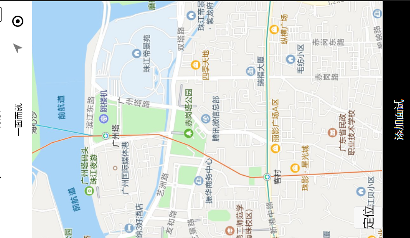

#一面而就
<h2>1.项目简介</h2>

````
此项目是仿照微信小程序做的面试类项目。框架已mpvue为主
````
<h2>2.技术栈</h2>

````
主框架为mpvue

````
<h2>3.项目运行</h2>

````
# 克隆项目
git@github.com:xiaozhangweijie/-interviewer.git

# 下载依赖
npm install

# 启动服务
npm start 

# 前端项目打包
npm run build
````
<h2>4.项目结构</h2>

````
├── dist // 源代码编译后的生成线上环境代码
├── node_modules // 依赖的第三方包
├── src // 生产目录
│ ├── components //各种组件
| ├── models //命名空间
| ├── routes //路由
| ├── pages //视图
| ├── services //接口
| ├── utils //公共方法
| ├── scss //样式处理
│ ├── index.css //入口文件样式
│ ├── index.js //入口文件
├── package.json // 项目信息文件
└── README.md // 说明

````

<h2>6.项目截图</h2>



